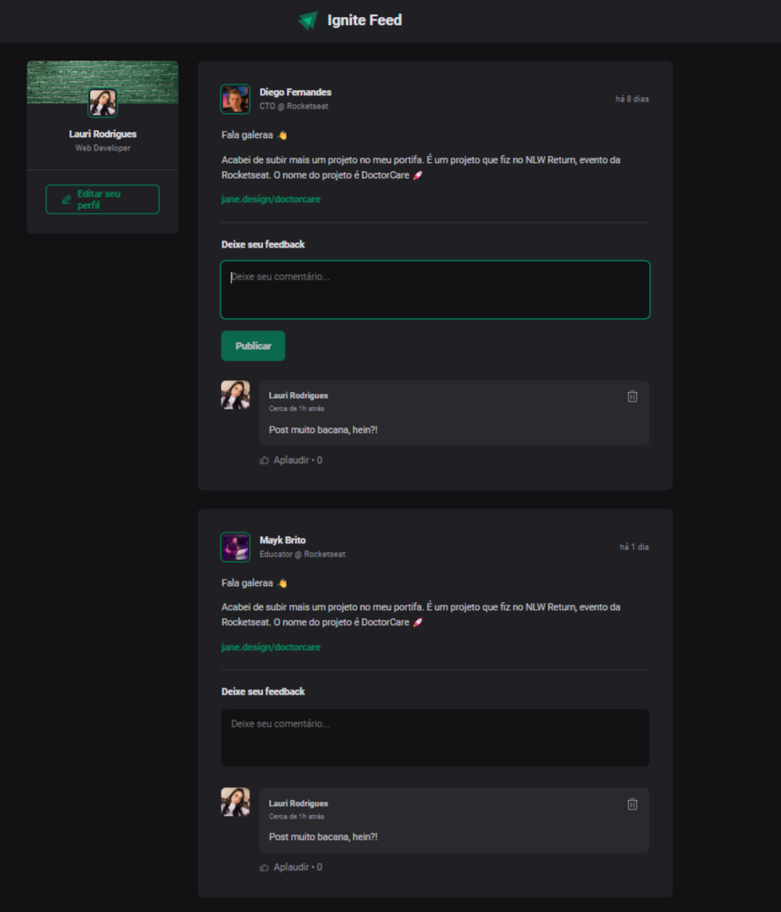

  

	
<h4 align="center"> 
	🚀 Projeto 01 | Nível 01 - Ignite (Trilha ReactJS)
</h4>

  

  
  
  
  
  <a href="https://ignitefeedreact.netlify.app/"> ▶️ Visualizar Deploy </a>

<h2 align=left> 💻 Sobre o projeto </h3>

 Projeto realizado durante o programa <strong>Ignite</strong> da <a href="https://www.rocketseat.com.br/"> <strong>Rocketseat</strong> </a>. É o primeiro projeto do programa na trilha de ReactJS, localizado no nível 1, onde construímos uma página no estilo feed, onde podemos fazer comentários em posts para conhecer conceitos de ReactJS como componentes, propriedades, estados, hooks, comunicação entre componentes, imutabilidade, closures, etc. Também foi aplicado TypeScript no projeto para uma melhor performance. 

  
<h2 align=left> 🛠 Tecnologias utilizadas </h3>

  
  
  
  
  

<h2 align=left> 🎨 Layout </h2>
<a href="https://www.figma.com/file/bzDOQGnevAnstaMGiWrxRE/Ignite-Feed-(Community)?type=design&node-id=1-35&t=7y2lfTtCeZgagWEN-0"> Visualizar no Figma </a>  

<h4>💻 Desktop </h4>

